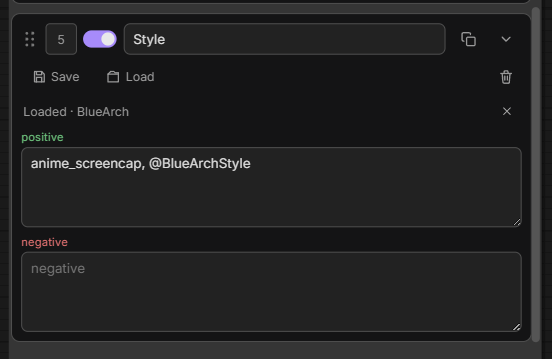
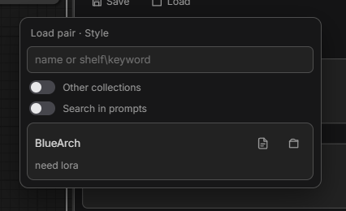
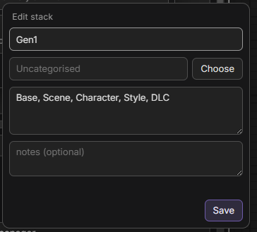
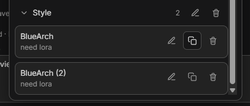

# Changelog

All notable changes to **Prompt Concatenate Pro** are documented here.

Format: newest first.

---

## [1.2.0] — 2026-08-27

### Library search, loaded pairs, and simpler stack edits

Working with a growing prompt library is less friction: find what you need faster, keep track of what you loaded, and tweak stacks without a full overwrite dance.

- After **Load pair**, the group shows **Loaded · name** with an **×** to detach (prompt text stays)
- **Save pair** prefills name, collection, and **notes** from the loaded source
- Load / manager search: AND tokens; optional `shelf\keyword` (or `/`) filters collections first
- **Search in prompts** toggle (off by default) — body text only when you ask for it
- **Other collections**, **Show empty**, and **Search in prompts** preferences persist in SQLite
- Empty shelves no longer leak into search results when **Show empty** is on
- Load dialogs stay on screen (reposition after content loads; flip above the button if needed)

- **Edit stack** can change slots in one text field (`Base, Scene, Character, …`)
- UI copy uses **notes** instead of “description” for the optional memo field
- Library manager: **Duplicate** on stacks and prompts (`Name` → `Name (2)`) to fork a version
- 

---

## [1.1.1] — 2026-08-16

### Library manager folders stay readable

With many collections open at once the list was hard to scan, and any reload (delete / rename) forced everything open again.

- Folders and collections default to **collapsed**
- Expand/collapse is remembered while the manager stays open
- Delete, rename, and list refresh no longer re-expand everything you closed
- Search still temporarily opens matching sections; clearing the query restores your fold state

---

## [1.1.0] — 2026-08-16

### Duplicate pair on the node

You can stack several complementary prompts from the same library shelf without merging them into one field.

- **Copy** button on each group card (after the title, before collapse)
- Creates a new group **directly under the source** (same positive / negative / enabled) — no scrolling the whole stack, no clever insert rules
- Title gets a numeric suffix: `Pose` → `Pose (2)` → `Pose (3)`
- Each copy has its own id and sidebar pin labels (`Pose (2) | positive`), so Favorites stay distinct
- **Save pair** / **Load pair** normalize the title: strip trailing ` (N)` and use the base name as the collection (`Pose (2)` → shelf **Pose**)
- Join order stays under your control via drag / priority; auto-numbering is only the title, not list position
- Existing workflows and library data from 1.0.x are unchanged; plain titles still map 1:1 to shelves

---

## [1.0.0] — 2026-08-14

Initial release:

- Modular prompt groups with join to `str_pos` / `str_neg`
- Sidebar pinning for per-group positive / negative
- Layout presets (stacks) and prompt pairs with SQLite library
- Library manager (rename / move / delete / edit)
